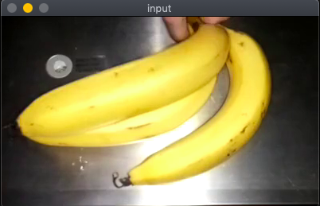
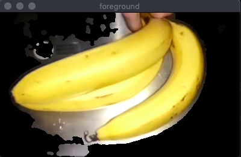
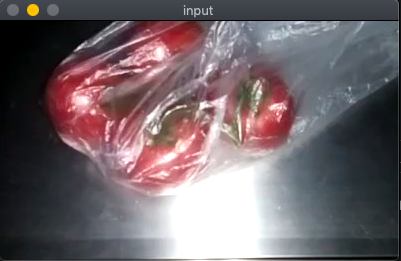
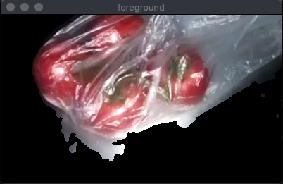

# Foreground Extraction

This project demonstrates usage of OpenCV algorithm for Background Subtractors.

This project expects video as input/sequence of images, as algorithm learns the background from sequences and not instantenously.

# Requirements

All the dependencies are listed in ```requirements.txt``` which can be installed by following command.

For Python 3.x
```
~$ sudo -H python3 -m pip install -r requirements.txt
```

For Python 2.x

```
~$ sudo -H python -m pip install -r requirements.txt
```

Note that, Program requires ```OpenCV v3.4.2``` APIs.


# Run

Project is divided into multiple files.

1. ```main.py``` - Main file (executable) to run the algorithm.
2. ```fg_extractor.py``` - contains class processing given image to extract foreground.
3. ```gui.py``` - PyQt based GUI utilities to add buttons on display windows

```main.py``` takes certain arguments to configure the execution. Following are the valid args.

```
$ python3 main.py -h
usage: main.py [-h] --video_path VIDEO_PATH [--fps FPS]
               [--display_resolution DISPLAY_RESOLUTION DISPLAY_RESOLUTION]
               [--debug_visualize]

optional arguments:
  -h, --help            show this help message and exit
  --video_path VIDEO_PATH
                        video file
  --fps FPS             fps
  --display_resolution DISPLAY_RESOLUTION DISPLAY_RESOLUTION
                        display resolution (WxH)
  --debug_visualize     enable debug windows to view masks
```

Sample command:

```
~$ python3 main.py --video_path <path/to/video.mp4> --fps 30 --display_resolution 320 240 --debug_visualize
```

# Results

Sample video is available in ```sample``` directory and resultant video can be found in ```output``` directory.

 

 